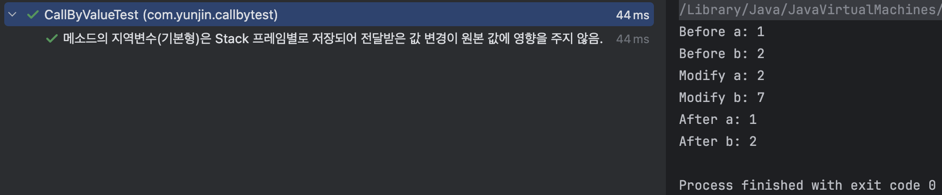

# 기술면접에서 Call By Value, Call By Reference 질문
원본 데이터 값 변경 유무에 대한 질문이다. 원본 데이터를 메소드의 인자값으로 넘겼을때 파라미터로 받은 변수의 값을 복사하는지, 주소값을 참조하는지 유무에 따라 값을 변경했을 때 원본 데이터의 영향도를 확인하는 의도이다.

> Tip. 인자(Argument)와 파라미터(Parameter) 차이
>
> 인자(Argument)는 메소드 호출 시 전달되는 값으로 sum(3,5)에서 3,5가 인자 입니다.
> 파라미터(Parameter)는 메소드 선언 시 정의된 변수로 void sum(int a, int b){ 생략 } 에서 a,b가 파라미터 입니다.


# Call By Value 와 Call By Reference 차이점
- 메서드를 호출할 때 인자를 전달하는 방법은 2가지가 있습니다.

|       Call By Value        |        Call By Reference         | 
|:--------------------------:|:--------------------------------:|
|          값에 의한 호출          |            참조에 의한 호출             |
|    인자로 받은 값을 복사하여 처리한다.    | 인자로 받은 값의 주소를 참조하여 직접 값에 영향을 준다. |
|       변수의 복사본이 전달된다.       |           변수 자체가 전달된다.           |
| 전달 받은 인수가 다른 메모리 위치에 생성된다. |    전달 받은 인수가 같은 메모리 위치에 생성된다.    |
|      원본 값이 수정되지 않는다.       |           원본 값이 수정된다.            |


# Call By Value 작동 방식
Call By Value는 메서드를 호출할 때 값을 넘겨주고, 넘겨받은 값을 복사해서 사용합니다.

A 메소드에서 B 메소드로 호출할 때, 인자를 전달받아 값을 복사 후 파라미터를 새로운 변수로 초기화 하므로 호출 받은 값을 변경해도 호출한 변수(원본)에는 아무런 영향이 없습니다.
그러므로, 메소드를 호출하는 원본 변수(인자)와 호출 받는 변수(파라미터)는 서로 다른 변수입니다.

# Call By Reference 작동 방식
절차지향언어인 C언어는 Call By Value(값에 의한 호출)를 사용합니다. 이후에 C언어를 기초로 문법은 그대로 유지하면서 OOP(객체지향 프로그래밍)기능만 추가한 C++언어에서 Call By Reference 사용이 가능하다. C++에서 처음으로 사용된 것이 아니고 Fortran(포트란)일 때 부터 Argument-Passing By Reference By Value라는 용어로 사용이 되었다고 한다.

> Tip. Fortran(포트란) 무엇인가?
> 
> 
> 
> 포트란(Fortran, 이전 명칭 FORTRAN)은 1954년 IBM 704에서 과학적인 계산을 하기 위해 시작된 컴퓨터 프로그램 언어로
> FORTRAN은 수식(Formula) 변환기(Translation)의 약자입니다.

Call by Reference는 값이 아닌 자신을 공유해서 사용하도록 허용하는 개념 입니다.  
A 메소드에서 B메소드로 호출할 때, 인자를 전달받아 값을 복사하는 것이 아니라 참조 자체를 넘기기 때문에 인자와 파라미터가 완전히 동일한 변수 입니다.
그러므로, 메소드 내에서 파라미터 값을 수정하면 그대로 원본 변수에도 반영이 됩니다. 

CS에서 사용되는 "Call By Reference"에서 "Reference"는 우리가 쓰는 '참조'라는 의미보다 더 좁은 의미로 사용되고 있습니다. 예전부터 CS에서 해당 parameter passing 방식을 여러가지 용어로 혼동되어 쓰였지만 ["Semantic Models of Parameter Passing" by Richard E Fairley, March 1973.](/docs/semanticModelsOfParameterPassingCuCs01673.pdf) 논문에서 처음으로 "Call By Reference"로 정의되었다고 합니다. 해당 논문에서 정의된 뜻을 살펴보면 다음과 같습니다.

> In Call By Reference, the address (name) of the actual parameter at the time of procedure call is passed to the procedure as the value to be associated with the corresponding formal parameter. References to the formal parameter in the procedure body result in indirect addressing references through the formal parameter values are immediately transmitted to the ceiling procedure, because both the acutal parameter and the formal parameter refer to the same register.

내용을 정리해보면, Reference는 두 파라미터가 모두 같은 주소값을 가리키고 있는 것이지 보조 파라미터가 해당 주소값을 '값'으로 들고 있는 것이 아니라고 정의를 내릴 수 있습니다.
(나도 보조 파라미터가 해당 주소값을 '값'으로 가지니깐 주소를 통해 원본 값을 변경할 수 있는 것이 Call By Reference 아닌가 싶었는데 그게 아니라, 주소값을 '값'으로 가지는 게 아니라 그냥 다른 alias 명칭이 있는 변수라고 보는 게 이해하기 쉽다. 헷갈리지만 차근차근 코드와 저장되는 메모리 위치를 보면 이해할 수 있습니다.)

# C++ (Call By Reference)
- C++에서는 포인트(*)와 참조자(&) 타입이 존재한다.
- 포인터(*)는 객체의 주소를 저장하고, 다른 객체를 가리키도록 변경 가능하다.
- 참조자(&)는 기존 객체의 별명(alias) 역할을 하며, 다른 객체를 가리킬 수 없다. 

## Code :

### Pointer
```java
#include <iostream>
using namespace std;

int main() {
    int a = 10;
    int* p = &a; // 'p'는 'a'의 주소를 저장하는 포인터 변수

    cout << "a의 값: " << a << endl;      // 10
    cout << "a의 주소: " << &a << endl;   // 0x... (메모리 주소)
    cout << "p가 가리키는 값: " << *p << endl; // 10

    int b = 20;
    p = &b; // 포인터는 다른 변수를 가리킬 수 있음
    cout << "p가 가리키는 값 (b): " << *p << endl; // 20

    return 0;
}
```


a 변수에 10을 저장하고, p라는 포인터 변수에 a의 주소값을 저장한다. 


포인터 변수는 새로운 변수의 주소값으로 변경할 수 있다.

### Reference
```java
#include <iostream>
using namespace std;

int main() {
    int a = 10;
    int& b = a; // 'b'는 'a'를 참조 (다른 변수명으로 a를 부르는 것과 동일)

    cout << "a의 값: " << a << endl;  // 10
    cout << "b의 값: " << b << endl;  // 10

    b = 20;  // 'b'를 변경하면 'a'도 변경됨
    cout << "a의 값 (b 변경 후): " << a << endl; // 20
    
    return 0;
}
```


C++에서 참조자는 원본 변수의 alias(별명) 역할을 하기 때문에, a와 b 변수는 같은 메모리 주소를 공유합니다.
a는 가리키는 또 다른 이름의 변수로 b를 명칭하기 때문에 단순히 **원본 변수의 이름을 다른 이름으로 부르는 것으로 별도의 메모리 공간을 갖진 않습니다.**
(내 이름이 홍길동이고 별명은 길똥이 등등 여러 별명이 있을 수는 있으나, 내 몸은 그대로 인 것 처럼 생각하면 이해가 쉽습니다.)

> 그러므로, Call By Reference는 C++의 Reference 참조 의미와 동일합니다. 

# Java에서 전달 방법은 무엇인가요?
Java에도 Call By Reference가 존재한다고 하지만 사실상 C++의 관점으로 바라본다면 Java에는 Call By Reference가 존재하지 않는다. 모든건 Call By Value로 작동됩니다.

# 자바가 Call By Value 이유
자바 창시자인 제임스 고슬링은 수많은  parameter passing 방법이 있지만 자바에는 간단하게 "call by value"만을 참고했다고 합니다.

> the Java authors choose to only include one simple idea - pass-by-value, with no default values or optional parameter (overloading often provides a satisfactory alternative), no variable length parameter lists (added finally in Java 5), no named parameters, no pass-by-reference, no const (a general Java issue) parameters, etc.
> 
> -The Java Programming Language, 2nd ed. by Ken Arnold and James Gosling, section 2.6.1, page 40, 3rd paragraph-

# Example 1: Java - Call By Value (primitive type)
## Code :
```java
public class CallByValueTest {

    @Test
    @DisplayName("메소드의 지역변수(기본형)은 Stack 프레임별로 저장되어 전달받은 값 변경이 원본 값에 영향을 주지 않음.")
    void primitiveTypeTest() {
        int a = 1;
        int b = 2;

        // Before
        System.out.println("Before a: " + a);
        System.out.println("Before b: " + b);

        assertThat(a).isEqualTo(1);
        assertThat(b).isEqualTo(2);

        modify(a, b);

        // After
        System.out.println("After a: " + a);
        System.out.println("After b: " + b);

        assertThat(a).isEqualTo(1);
        assertThat(b).isEqualTo(2);
    }

    private void modify(int a, int b) {
        a++;
        b = 7;
        System.out.println("Modify a: " + a);
        System.out.println("Modify b: " + b);
    }
}
```
## Output :


## Explanation (jvm 메모리 할당) :


메모리 할당된 상태를 그려보면 jvm은 메소드별로 stack 메모리 영역에 프레임이 생성되어 프레임 내부에 변수와 값이 할당됩니다. 
호출한 메소드의 지역변수를 넘겨 받은 메소드의 파라미터는 복사가 되어 메모리에 할당 됩니다.
즉, 값을 복사해서 새로운 변수에 담습니다.

# Example 2: Java - Call By Value (reference type)

## Code :
```java
class User {
public int age;

    public User (int age) {
        this.age = age;
    }
}

public class CallByReferenceTest {

    @Test
    @DisplayName("메소드의 지역변수(참조형)은 Stack 프레임별로 저장되어 Heap영역의 주소값을 들고 있기때문에 원본 값에 영향을 주기도 하고, 안주기도 한다.")
    void referenceTypeTest() {
        User a = new User(1);
        User b = new User(2);

        // Before
        System.out.println("Before a: " + a.age);
        System.out.println("Before b: " + b.age);

        assertThat(a.age).isEqualTo(1);
        assertThat(b.age).isEqualTo(2);

        modify(a, b);

        // After
        System.out.println("After a: " + a.age);
        System.out.println("After b: " + b.age);

        assertThat(a.age).isEqualTo(2);
        assertThat(b.age).isEqualTo(2);
        assertThat(b.age).isEqualTo(7); // 자바가 Call By Reference 방식이 아닌 이유, 값을 변경하면 무조건 원본 값에 영향을 준다
        assertThat(b.age).isEqualTo(7);
    }

    private void modify(User a, User b) {
        a.age++;
        b = new User(6);
        b.age++;

        System.out.println("Modify a: " + a.age);
        System.out.println("Modify b: " + b.age);
    }
}
```
## Output :


## Explanation (jvm 메모리 할당)


객체는 Heap 메모리 영역에 a,b 객체가 각각 할당되고, 메모리 주소값이 Stack 프레임의 변수 값으로 초기화 되어 저장됩니다.
즉, 변수의 값은 다른 객체의 메모리 주소가 초기화 됩니다.


modify() 메소드가 호출되면 새로운 스택 프레임에 새로운 변수로 할당되고, 기존에 Heap 메모리에 저장된 객체의 주소값을 가르킵니다.
주소값을 통해 원본 데이터를 직접 접근 가능하므로 수정이 가능합니다. C++의 포인터와 비슷합니다.
주소값을 다른 객체의 주소값으로 변경도 가능합니다. 즉, 호출한 변수와 호출된 변수의 메모리 주소가 다릅니다. 
그러므로, C++의 Call By Reference 개념과는 다릅니다. Call By Reference는 변수 자체의 주소값이 똑같기 때문에 b 객체가 변경되면 a 객체도 변경되어야 합니다.


modify() 실행 후 메소드가 종료되면, 스택 프레임이 사라지고 호출 메소드의 스택 프레임만 남고
호출된 메소드에서 a 객체의 원본 데이터를 변경 했기 때문에 a 객체의 age는 변경이 됩니다. b 객체는 초기화 값 그대로 입니다.

# 마무리
CS 이론에서는 "Call by value"와 "Call by reference"를 구분하는 것은 더 이상 의미가 없다고 합니다. 왜냐하면 "Call By Reference"은 이제는 트렌드에 뒤쳐진 기술로 선호도 굉장히 낮아져 최신 언어에서는 더 이상 사용되지 않고 이를 통합한 방식으로 사용되고 있기 때문입니다.
신입 기술면접 CS 목록에는 봤던 기억이 있어서 단어는 알고 있었는데 어떤 것을 의미하는 질문인지 기억이 안났어요. 
어쩐지 최근 자바 서적에서는 Call By Value와 Reference에 대한 내용을 못봤는데, 자바에서 채택하는 방식이나 메모리 구조에 대해 이해하는데 도움이 되기 때문에 짚고 넘어가는 것이 좋다고 생각하여 정리를 했습니다.

개인적으론 확실히 기초 원리에 대한 중요성을 느끼며, 오랜만에 프로그래밍 기초를 깊게 학습하니 즐거웠습니다.

# ref
- [자바가 Call by Value 방식인 이유](https://dev-coco.tistory.com/189)
- [Java 의 Call by Value, Call by Reference](https://bcp0109.tistory.com/360)
- [자바가 언제나 Call By Value인 이유](https://loosie.tistory.com/m/486)